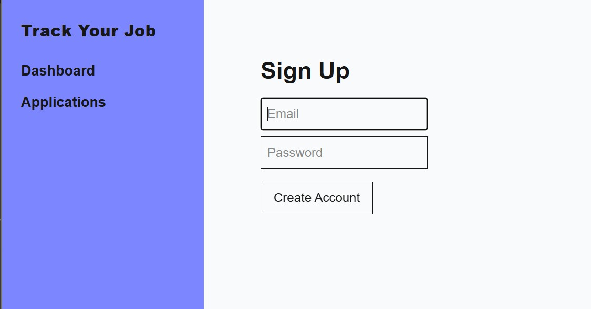
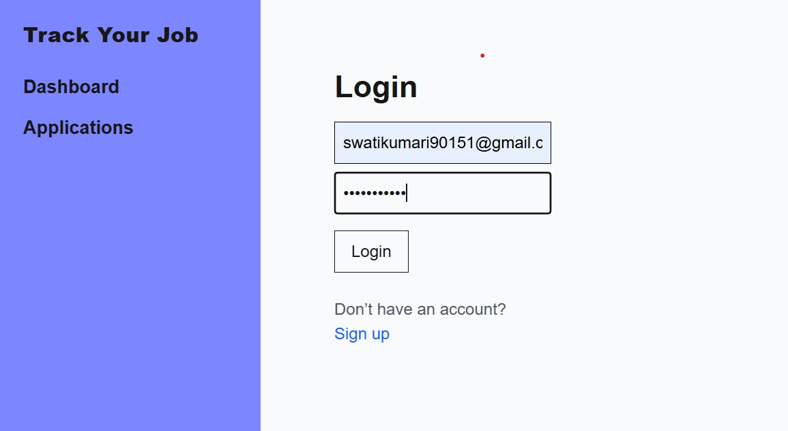
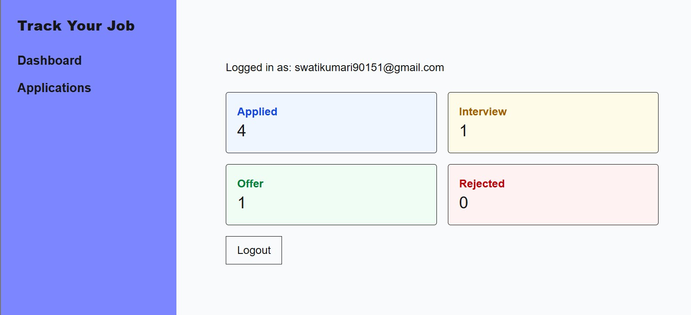
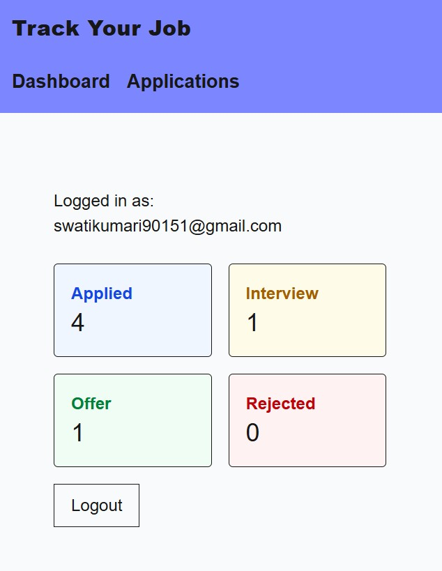
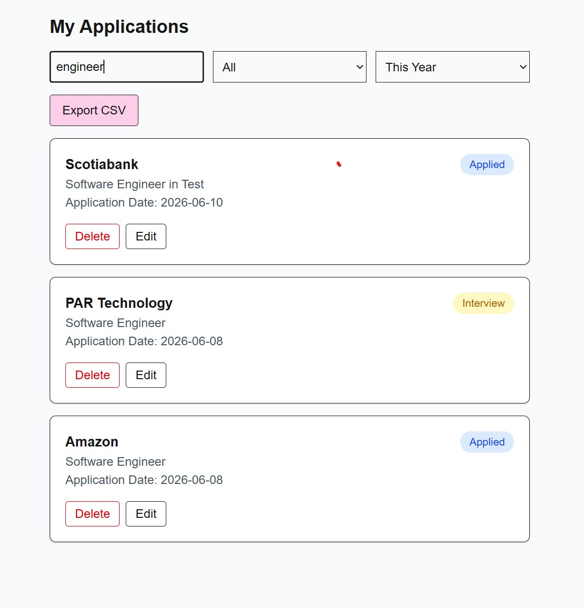
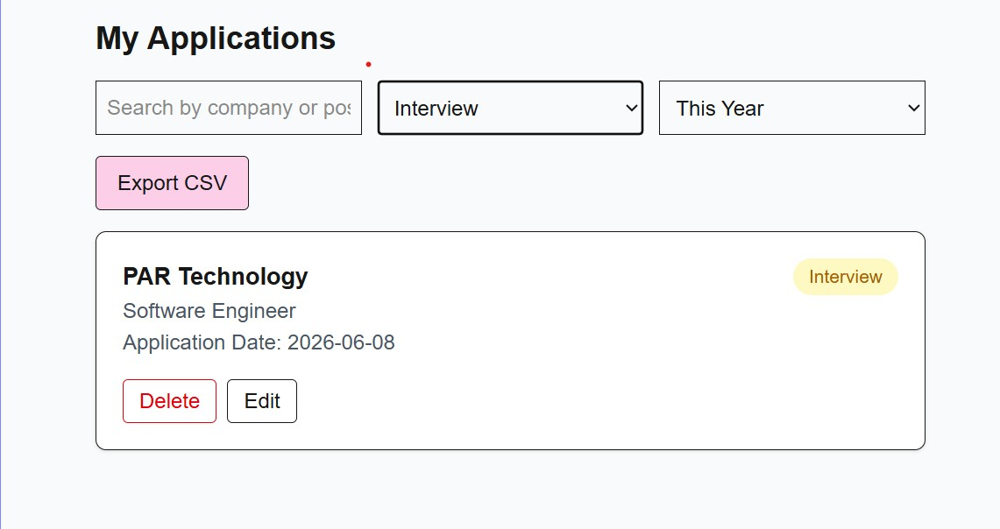
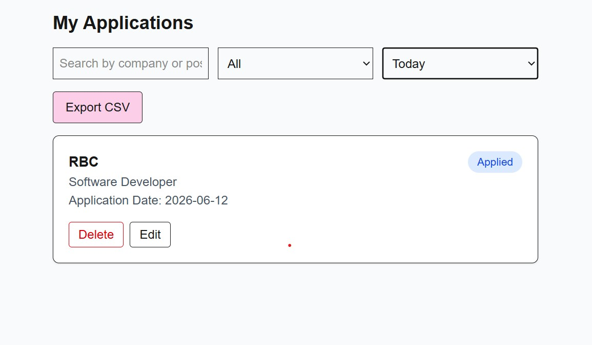

# Track Your Job

A full-stack job application tracker built with Next.js, TypeScript, Supabase, and Tailwind CSS. It helps users manage and monitor their job search in one place, with status tracking, filtering, and CSV export.

**Live demo:** [track-your-job-three.vercel.app](https://track-your-job-three.vercel.app/)

## Features

**Authentication**
- Sign up / login with Supabase Auth
- Secure session handling
- Protected routes for authenticated users

**Dashboard**
- Summary of total applications
- Status breakdown: Applied, Interview, Offer, Rejected

**Application management**
- Add, edit, and delete job applications
- Update application status
- Clean, sortable list view

**Filtering and search**
- Search by company or position
- Filter by status
- Filter by date range (today, last 7/30/90 days, this year)

**Export**
- Export applications to CSV, including filtered results

**UI**
- Responsive sidebar layout
- Color-coded status badges
- Clean, SaaS-style interface

## Tech stack

- **Frontend:** Next.js (App Router), TypeScript, Tailwind CSS
- **Backend:** Next.js API routes
- **Database:** Supabase (PostgreSQL)
- **Auth:** Supabase Auth (with Row Level Security)
- **Deployment:** Vercel

## Project structure

```
/app
  /applications
  /dashboard
  /login
  /signup
/lib
  supabase-client.ts
```

## Getting started

1. Clone the repository
   ```bash
   git clone https://github.com/SwatiKumari18/track-your-job.git
   cd track-your-job
   ```

2. Install dependencies
   ```bash
   npm install
   ```

3. Set up environment variables

   Create a `.env.local` file:
   ```
   NEXT_PUBLIC_SUPABASE_URL=your_supabase_url
   NEXT_PUBLIC_SUPABASE_ANON_KEY=your_supabase_anon_key
   ```

4. Run the development server
   ```bash
   npm run dev
   ```

## Screenshots

| Sign-Up | Login |
|---|---|
|  |  |

| Dashboard | Dashboard-Mobile |
|---|---|
|  |  |

| Filter By Name | Filter By Status | Filter By Timeframe |
|---|---| --- |
|  |  |  |

## What I learned

- Implementing full-stack authentication with Supabase
- Enforcing data access with Row Level Security (RLS)
- CRUD operations against PostgreSQL
- State management and data filtering in React
- Generating CSV exports on the frontend
- Building a production-style UI with Tailwind CSS

## Future improvements

- Email reminders for follow-ups
- Drag-and-drop Kanban-style pipeline
- Analytics charts for application funnel
- Mobile app version

## Author

Built by [Swati Kumari](https://github.com/SwatiKumari18)